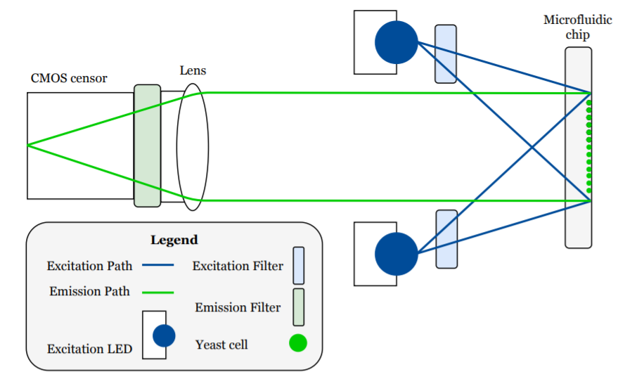
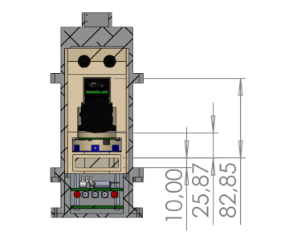

    <a href="https://benchling.com/organizations/acubesat/">Benchling 🎐🧬</a> &bull;
    <a href="https://gitlab.com/acubesat/documentation/cdr-public/-/blob/master/DDJF/DDJF_PL.pdf?expanded=true&viewer=rich">DDJF_PL 📚🧪</a> &bull;
    <a href="https://spacedot.gr/">SpaceDot 🌌🪐</a> &bull;
    <a href="https://acubesat.spacedot.gr/">AcubeSAT 🛰️🌎</a>

---

## Imaging System

The imaging system is designed to function as a single-channel miniaturized fluorescence microscope. It consists of five main parts:

1. Camera
2. Imaging Lens
3. Excitation LED Board
4. Emission Filter
5. Excitation Filter

High-level ray diagram:

A technical drawing of the imaging system depicting the relevant optical distances:

